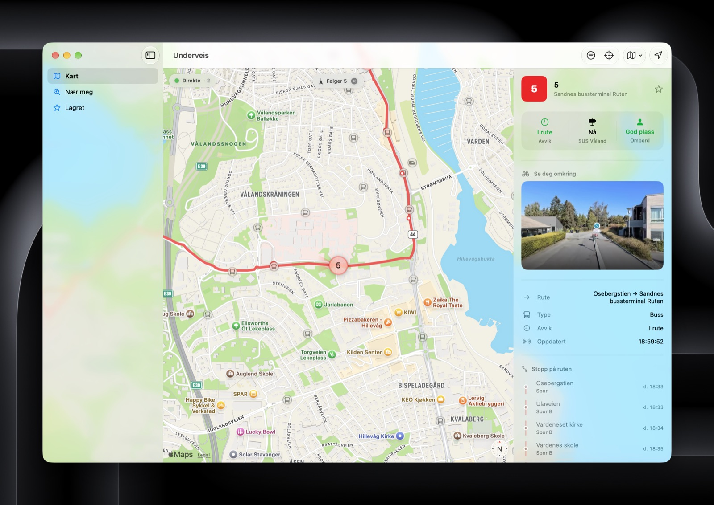

# Underveis

A universal **SwiftUI + MapKit** app for iPhone and Mac that shows Norwegian public-transit
vehicles moving in realtime, streamed from [Entur](https://developer.entur.org)'s open
real-time vehicle API.



## Features

- **Live positions** via Entur's GraphQL-over-WebSocket subscription (`graphql-transport-ws`),
  with smooth marker interpolation between updates.
- **Viewport-scoped**: only vehicles inside the visible map area are subscribed, using Entur's
  server-side `boundingBox` + `mode` filtering.
- **All transit modes** with an on-map filter (defaults to buses).
- **Follow mode**: tap a vehicle to track it as it moves; the camera keeps it centred.
- **Journey view**: the followed vehicle's full route is drawn on the map, with every stop and its
  live call time, delay status, and onboard occupancy.
- **Ride along**: an Apple Look Around street-level preview that advances with the vehicle.
- **Transit stops** from the National Stop Register, with a **live departures board** — tap a stop
  for real-time departures and countdowns that tick every second.
- **Nær meg**: the nearest stops around you with their next departures.
- **Saved**: favourite stops, watched lines (always shown regardless of the mode filter), and recents,
  persisted with **SwiftData**.
- **Departure reminders**: a local notification a chosen number of minutes before a departure.
- **Real line colours** enriched from the Entur Journey Planner v3 API and cached with SwiftData.
- **Swift 6** strict concurrency throughout.

## Requirements

- Xcode 26 or later (developed against Xcode 27 beta), iOS 26 / macOS 26 SDK.
- [`xcodegen`](https://github.com/yonaskolb/XcodeGen) ≥ 2.41 (`brew install xcodegen`).

## Getting started

```sh
make open        # generate the Xcode project and open it
```

Simulator and macOS builds need no signing. To run on a device, put your Apple team ID in a
git-ignored `Local.mk` and regenerate:

```sh
echo 'UNDERVEIS_TEAM=ABCDE12345' > Local.mk
make generate
```

If you fork and ship your own build, also change `bundleIdPrefix` / `PRODUCT_BUNDLE_IDENTIFIER` in
`project.yml`. The `ET-Client-Name` sent to Entur is derived from the bundle identifier, so your fork
identifies itself correctly without further changes.

> The Makefile prefers the Xcode 27 beta and otherwise uses whatever `xcode-select` points at. The
> Command Line Tools **cannot** build this app; set `DEVELOPER_DIR` in `Local.mk` to a full Xcode if
> needed.

### Command line

```sh
make generate    # regenerate Underveis.xcodeproj from project.yml
make build-ios   # build for the iOS Simulator
make build-mac   # compile the macOS app (signing disabled)
```

`Underveis.xcodeproj` is generated by xcodegen but **committed** (so Xcode Cloud can build it). Never
edit it by hand — change `project.yml`, run `make generate`, and commit the result. Adding or
removing source files also requires a regen.

## How it works

Layered, with a hard `actor` → `@MainActor` boundary. `Vehicle`, `Stop`, and `Departure` are
immutable `Sendable` value types that cross it.

| Layer                  | Type                     | Responsibility                                                                                                |
| ---------------------- | ------------------------ | ------------------------------------------------------------------------------------------------------------- |
| `EnturVehiclesClient`  | `actor`                  | Owns the WebSocket, speaks `graphql-transport-ws`, re-subscribes on viewport change, reconnects with backoff. |
| `JourneyPlannerClient` | `actor`                  | HTTP Journey Planner v3 lookups: line colours, stop places in a bounding box, departures, and full journeys.  |
| `LineColorStore`       | `@MainActor @Observable` | Resolves line → colour, caches results in SwiftData (`CachedLine`) via a background `LineCacheWriter`.        |
| `PersonalizationStore` | `@MainActor @Observable` | Favourite stops, watched lines, and recents; in-memory snapshots persisted via a background SwiftData writer. |
| `VehiclesModel`        | `@MainActor @Observable` | Holds the live vehicle + stop sets, debounces the viewport, applies the mode filter, evicts stale vehicles.   |
| `JourneyModel`         | `@MainActor @Observable` | Loads the followed vehicle's route and calls, re-polls call times, and ticks the countdowns.                  |
| `DeparturesModel`      | `@MainActor @Observable` | Polls the selected stop's departures and runs a 1 Hz ticker so countdowns stay live between fetches.          |
| `NearbyModel`          | `@MainActor @Observable` | Finds stops around the user's location and previews their next departures.                                    |
| `RideAlongModel`       | `@MainActor @Observable` | Fetches the Look Around scene at the followed vehicle's position, throttled by distance travelled.            |
| `ReminderStore`        | `@MainActor @Observable` | Schedules departure reminders as local notifications; pending notifications are the source of truth.          |
| `LocationProvider`     | `@MainActor @Observable` | Core Location wrapper for the initial camera and Nær meg.                                                     |
| `VehicleMapView` / UI  | SwiftUI                  | `Map` with a marker per vehicle and stop; clustering, follow mode, route line, filter popover, detail inspector. |

No API key is required; all requests identify themselves with the `ET-Client-Name` header.

## Contributing

See [CONTRIBUTING.md](CONTRIBUTING.md).

## License

Source code is [MIT](LICENSE). The Underveis name and app icon are not covered by the license.

Real-time and journey-planner data from **Entur**, licensed under
[NLOD](https://data.norge.no/nlod/en/2.0).
